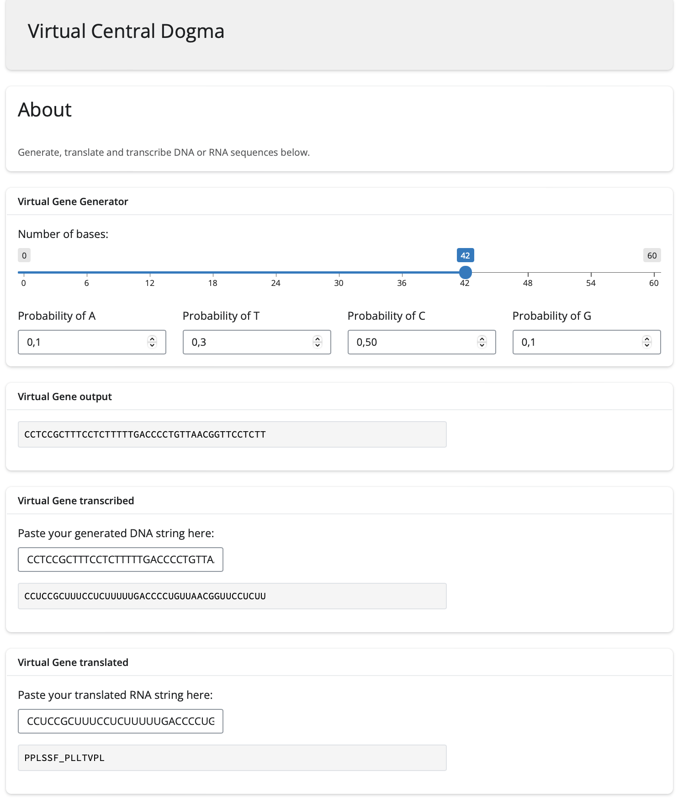

# group_03_shiny

## Group members:

s225049: Ida Sofie Goldschmidt\
s225074: Annekatrine Kirketerp-Møller\
s225051: Emil August Dissing Berntsen\
s224974: Rasmus Kamp\
s215109: Rolf Larsen

## Installation and use

Install the app from this repository, and run the app from the virtual_central_dogma.R file. If necessary, install dependent packages.

## Description

The shiny app is developed to have simple functions for a Virtual Central Dogma with a simple User Interface. The functions include simulating a DNA string with customizable length and amino acid composition. The app also has the ability to transcript to RNA and translate to amino acid sequence. The figure below, shows the interface with example usage.

